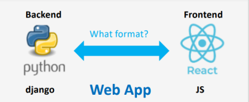

# YAML Deep Dive

## **Introduction to YAML - Why do we need it?,Introducing YAML Structure Basic Rules,Helpful online YAML tools**

**YAML (YAML Ain’t a Markup Language) – Why do we need it?**

We have many programming languages, but only a few ways to store and share data.

Applications need a common language to communicate. This is called a **data serialization language**.

Common data serialization languages are:

* **XML**
* **JSON**
* **YAML**

**Example:**\
Imagine a web application:

* The **frontend** is built with JavaScript
* The **backend** is built with Python (Django)

They need to talk to each other. JavaScript and Python are different languages, so they can’t directly understand each other.

Solution: Use a **data serialization language** (like JSON or YAML) to exchange information. This way, both sides can send and receive data in a standard format.

**Use cases:** Configuration files, Ansible, Kubernetes, APIs.

<figure><figcaption></figcaption></figure>

**Example:**\
The two parts of a web application (frontend and backend) can communicate using a data serialization language, like **JSON**.

Each part needs a **JSON module** to read and write JSON data:

* **Frontend (JavaScript)** uses a JSON module to convert JSON into JavaScript objects.
* **Backend (Python)** uses a JSON module to convert JSON into Python objects.

This way, both sides can understand the same data, even if they use different programming languages.

<figure><figcaption></figcaption></figure>

**Why YAML and not JSON or XML?**

All three are **data serialization languages**. The same data can be written in each format:

 

<figure><figcaption></figcaption></figure>

**YAML (YAML Ain’t a Markup Language)**

* **YAML** is a human-readable data serialization language.
* It is easy to understand and write.
* YAML is used to create **configuration files**.
* Most popular programming languages can use YAML.
* YAML is widely used in **DevOps tools** like:
  * **Kubernetes**
  * **Ansible**
  * **Docker**
  * **Prometheus**
  * **AWS CloudFormation**

<figure><figcaption></figcaption></figure>

**YAML – Use Cases**

YAML is useful for:

* **Configuration files** (e.g., app settings)
* **Log files** (recording events)
* **Inter-process messaging** (communication between programs)
* **Cross-language data sharing** (e.g., Python talking with JavaScript)
* **Object persistence** (storing data)
* **Debugging complex data** (understanding large or nested data)

**Why YAML is readable:**

* Uses **Unicode printable characters**.
* Some characters show **structure**, the rest is **data**.
* Few extra symbols, so it’s **easy to read**.

<figure><figcaption></figcaption></figure>

**YAML – Basic Data Structures**

YAML has **three main data structures**:

1. **Scalars** – single values like strings, numbers, or Boolean
2. **Mappings** – key-value pairs (like dictionaries or hashes)
3. **Sequences** – lists or arrays

**When to use which:**

* Depends on the **tool** or **data structure** you need.
* Mappings for structured objects, sequences for lists, scalars for single values.

**Additional features in YAML:**

* **Typing system** – helps define data types clearly.
*   **Aliasing** – reuse data without repeating it.

    This way, you can reuse `default_car` without writing it again.

**YAML – Comments**

* **Comments** are notes for humans.
* They are **not processed** by programs.
* You can write comments:
  * On a **separate line**
  * After some **data on the same line**

<figure><figcaption></figcaption></figure>

***

**YAML – Structure & Rules: Start and End of Documents**

* A YAML file can have **one or more documents**.
* **Start of a document:** `---` (three dashes)
* **End of a document:** `...` (three dots)
* Multiple documents can be in the **same file** (called a stream).
* Using multiple documents depends on the **tool** you are working with.

<figure><figcaption></figcaption></figure>

**AML – Online Validator Tool**

* Online YAML validators **check your YAML file** for errors.
* They **highlight mistakes** in your syntax.
* They tell you if your **YAML is valid or not**.

&#x20;[https://onlineyamltools.com/validate-yaml](https://onlineyamltools.com/validate-yaml)

**YAML – Online YAML Viewer**

* A YAML viewer lets you **see the structure and content** of a valid YAML file.
* Example: [jsonformatter.org YAML Viewer](https://jsonformatter.org/yaml-viewer)

**How Ansible or Kubernetes understand YAML:**

* They **read the YAML file** and convert it into **data they can use** (like dictionaries, lists, and values).
* YAML syntax tells them **what each value means**.
* That’s why the file must be **correctly formatted**.

Data in YAML is represented as **key/value pairs**.\
We can set the value directly to the key, or through **sequences** (also called lists or arrays) and **mappings** (also called hashes or dictionaries).

<figure><figcaption></figcaption></figure>

**YAML – Words in Keys: Separation**

* Words in keys can be separated by:
  * **Underscores** (most popular)
  * **Dashes**
  * **Spaces**

<figure><figcaption></figcaption></figure>

**YAML – Structure & Rules: Colon and Space (`:` )**

* A **colon followed by a space (`:` )** is used to separate a **key** from its **value** in key/value pairs.

<figure><figcaption></figcaption></figure>

**YAML – Block Collections: Key/Value Pairs (cont.)**

A **value** (after the colon `:`) can be:

* A **string** (e.g., "alice john")
* An **integer** (e.g., 5)
* A **float** (e.g., 50.5)
* A **Boolean** (e.g., true, false, on, off, yes, no)
* A **date** (e.g., YYYY-MM-DD HH:MM:SS)
* **Null** (empty value)

**Note:** YAML is **case sensitive**.

<figure><figcaption></figcaption></figure>

**ML – Different Key/Value Pairs Examples**

* All of these are **valid YAML key/value pairs**.
* The **tool** you use can guide you on the **correct format** for key/value pairs.

<figure><figcaption></figcaption></figure>

**YAML – Strings & Quotes**

* You can use **double quotes**, **single quotes**, or **no quotes** around a string value.
* If a string contains **special characters** (`: { } [ ] , & * # ? | - < > = ! % @ '`), you must **use single or double quotes** to escape it.

<figure><figcaption></figcaption></figure>

**YAML – Block Collections: URLs in YAML**

* When writing a **URL** as a value, it is better to use **single quotes**.
* This helps escape the **colon (`:`)** after `http` or `https`.
* Using quotes prevents YAML from confusing the URL with key/value syntax.

<figure><figcaption></figcaption></figure>

**YAML – Block Collections: Mappings / Hashes / Dictionaries**

* A **mapping (dictionary/hash)** is used to assign **multiple values to one key**.
* YAML uses **indentation** to show the relationship between the **parent and its children**.
* Each **entry must begin on a new line**.

<figure><figcaption></figcaption></figure>

**YAML – Block Collections: Use of Indentation (Spaces)**

* Keys or objects at the same level (**siblings**) must have the **same number of spaces**.
* This keeps the **structure clear and correct**.
* Correct indentation is very important in YA

<figure><figcaption></figcaption></figure>

**YAML – Block Collections: Mappings / Dictionaries / Hashes**

* A **mapping** uses a **colon and space (`:` )** to separate each **key/value pair**.
* Mappings are an **unordered collection** of key/value pairs.

<figure><figcaption></figcaption></figure>

**AML – Block Collections: Mappings / Dictionaries / Hashes – A Different Way**

* You can use **curly brackets (`{}`)** to represent mappings.
* This is another way to write **key/value pairs** in YAML.
* It is called the **inline format**.

<figure><figcaption></figcaption></figure>

**YAML – Block Collections: Sequences / Lists / Arrays**

* Sequences (lists/arrays) are used to store a **list of items**.
* Each item in the list starts with a **dash and space (`-` )**.
* This means every item must have **`-` before it**.
* The **order of items is important** in a sequence.

<figure><figcaption></figcaption></figure>

**YAML – Sequences / Lists: Indentation and Hyphens**

* The **hyphens (`-`)** of list items can be **indented or not**.
* Both ways will work correctly.
* This means indentation is **not strictly required** for list items.
* However, as a **best practice**, you should use **proper indentation** to keep the file clear and readable.

<figure><figcaption></figcaption></figure>

**AML – Sequences / Lists: Item Types**

* Items in a sequence (list/array) can be a **scalar value**.
* Items can also be a **key/value pair**.

<figure><figcaption></figcaption></figure>

**YAML – Sequences / Lists: Square Brackets**

* A sequence (array/list) can also be written using **square brackets (`[ ]`)**.
* This is called the **inline format**.
* The **tool you use** (like Ansible) decides which **data structure** to use in different parts of the configuration file.

<figure><figcaption></figcaption></figure>

**YAML – Lists / Sequences / Arrays**

* A list (sequence/array) is an **ordered collection of items**.
* These items can include **key/value pairs**.
* These are **valid YAML syntax**.

<figure><figcaption></figcaption></figure>

**YAML – Block Collections: Mappings / Dictionaries / Hashes**

* You can **set a direct value** to a key.
* Or you can **use a list or map** as the value.
* **You cannot use both** (direct value and list/map) for the same key.

<figure><figcaption></figcaption></figure>

**YAML – A Sequence (List/Array) of Mappings (Dictionaries)**

* A **list item** can be a **mapping (dictionary)** or key/value pairs.
* The **hyphen (`-`)** shows that it is a **list item**.
* A **dictionary list item** can have **multiple key/value pairs**.
* This allows you to have a **list of dictionaries**, where each dictionary contains several items.

<figure><figcaption></figcaption></figure>

**AML – A Sequence (List/Array) of Mappings (Dictionaries) – Alternative Format**

* There is a **different way** to write list items.
* You can place the **hyphen (`-`)** **before the mapping** in a slightly different style.
* Both ways are **valid YAML**, but the choice depends on **readability and preference**.

<figure><figcaption></figcaption></figure>

**AML – Sequence (List/Array) of Mappings (Dictionaries)**

* A **list item** can be a **mapping (dictionary)** or key/value pairs.
* Each **dictionary’s items** can be in **any order**.
* The **order of list items** is **important**.

<figure><figcaption></figcaption></figure>

**YAML – A Sequence (List/Array) Nested in a Mapping (Dictionary)**

* You can **nest a list** as the **value of a mapping (dictionary) key**.
* The list can be written in **block format** or using **square brackets `[ ]`** inside the mapping.

<figure><figcaption></figcaption></figure>

**YAML – Sequence of Sequences (Nested Lists/Arrays)**

* A **list item** can itself be a **list**.
* This means you can **nest a list/array inside another list**.
* Nested sequences allow representing **more complex structured data**.

<figure><figcaption></figcaption></figure>

**YAML – Nested Dictionaries**

* A **dictionary item** can itself be **another dictionary**.
* This allows you to **create complex, hierarchical data structures**.

<figure><figcaption></figcaption></figure>

**YAML – Mixed Structures**

* You can **mix different structures** or use them **alternatively**.
* You can use **lists as keys** with **square brackets `[ ]`**.
* Some lists may **not have a name or parent**, but they can still exist as valid YAML.

<figure><figcaption></figcaption></figure>

**YAML – Multi-line Strings**

* **Greater than (`>`)** after a key and colon:
  * Converts **new lines** in the string into **spaces**.
  * Useful for **long text in one line**.
* **Pipe (`|`)** after a key and colon:
  * **Preserves new lines** exactly as written.
  * Useful for **formatted or multi-line text**.

<figure><figcaption></figcaption></figure>

**YAML – Multi-line Strings: Passing a Bash Script**

* You can use the **pipe (`|`)** in a **list item** to include a **bash or shell script** as the value of a key.
* This allows the **tool reading the YAML** (like Ansible) to **understand each command separately**.
* **Formatting and line breaks** are **preserved** exactly as written.
* **Indentation is important**—each line of the script must be properly indented under the key.

<figure><figcaption></figcaption></figure>

**YAML – Complex Keys**

* When a **key spans multiple lines**, it is called a **complex key**.
* Use **`?`** before the key and **`:`** after it to define it.
* This tells YAML that the **multi-line key** belongs to a value.

<figure><figcaption></figcaption></figure>

**YAML – Aliases / Anchors**

* **Anchors** let you **duplicate content** in a YAML document.
* Define an anchor by **prefixing a name with `&`**.
* Use the anchored content anywhere in the document with **`*` and the anchor name**.
* This helps **reuse data without repeating it**.

<figure><figcaption></figcaption></figure>

**YAML – Merge (`<<`)**

* You can use **anchors (`&`)** together with the **merge key (`<<`)**.
* This allows you to **copy an entire object** (mapping or list) to another part of the YAML document.
* It helps **reuse complex data structures** without rewriting them.

<figure><figcaption></figcaption></figure>

***

**YAML – File Extensions and Editors**

* YAML files can be saved with **`.yaml`** or **`.yml`** extensions.
* When working in a team with tools like **Ansible** or other **IAC tools**, everyone can use these extensions.

**Popular YAML Editors / IDEs:**

* **Microsoft Visual Studio (VS)** – [Download](https://visualstudio.microsoft.com/downloads/)
* **PyCharm** – [Download](https://www.jetbrains.com/pycharm/download/#section=mac)
* **Eclipse IDE**
* Many **free online YAML editors/validators** are also available.

***

**Who Decides the YAML Structure?**

* The **tool developer** decides how data should be represented:
  * Key/value pairs
  * Lists / sequences
  * Dictionaries / mappings
  * Nested structures
* Example: As a **DevOps engineer**, you write a YAML file for **Kubernetes**.
  * You send your YAML file to the **Kubernetes API server**.
  * The API server **understands the YAML** based on how the developers designed it.
  * It translates the YAML into **JSON internally** and Kubernetes performs the actions you requested.
* Every tool with an **API server** works similarly: the API server is the **endpoint** that understands your YAML and executes the instructions.

**Analogy:**

* Think of the API server like a **kitchen in a restaurant**.
* You (the customer) send a **request (YAML)** to the kitchen.
* The kitchen (API server) knows **how to process the request** and delivers the result, even if you don’t know all the internal steps.

<figure><figcaption></figcaption></figure>

**Application Programming Interface (API)**

* **APIs** let applications and microservices **communicate** with each other.
* APIs **hide the complexity** of the application’s code from other components.
* In simple words: when **different parts of an app want to talk**, you use **APIs** to connect them.

<figure><figcaption></figcaption></figure>

**Example – Kubernetes YAML Definition File**

* A **Kubernetes YAML file** contains **objects and configuration** for Kubernetes.
* We can **analyze the structure** without worrying about the exact meaning of the objects in Kubernetes right now.
* The focus is on **understanding how YAML is written and structured**.

<figure><figcaption></figcaption></figure>
